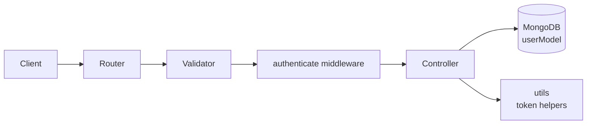
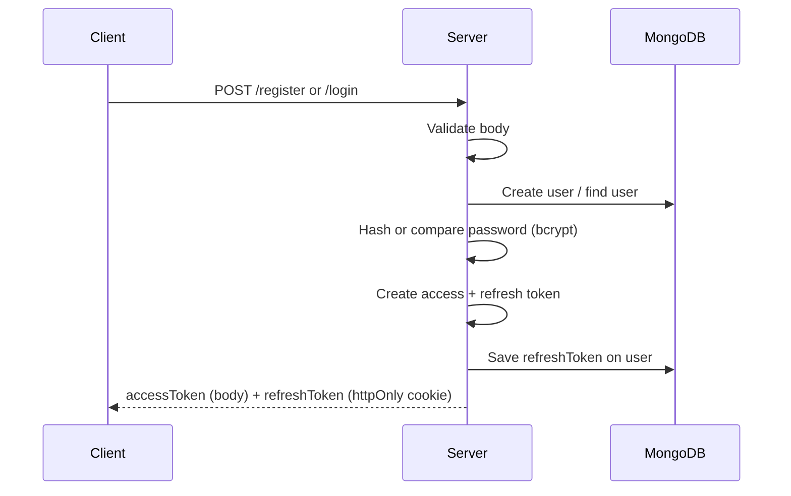
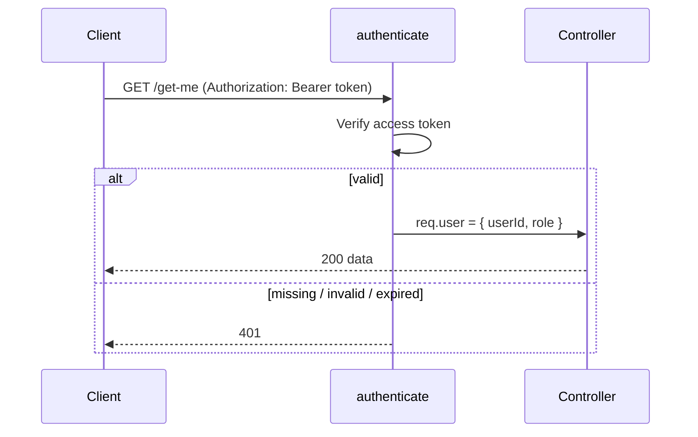
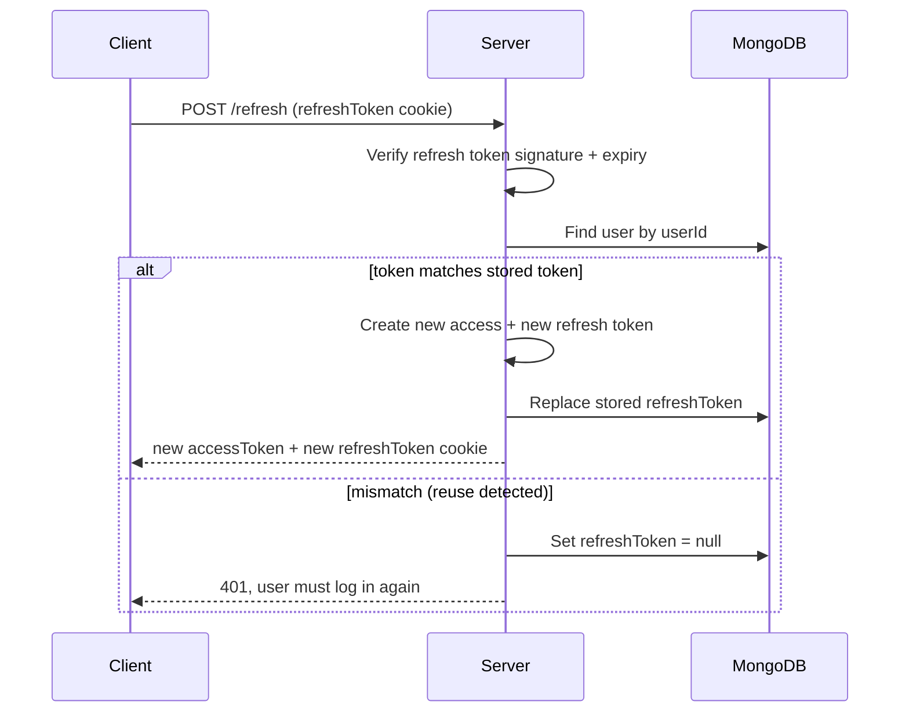
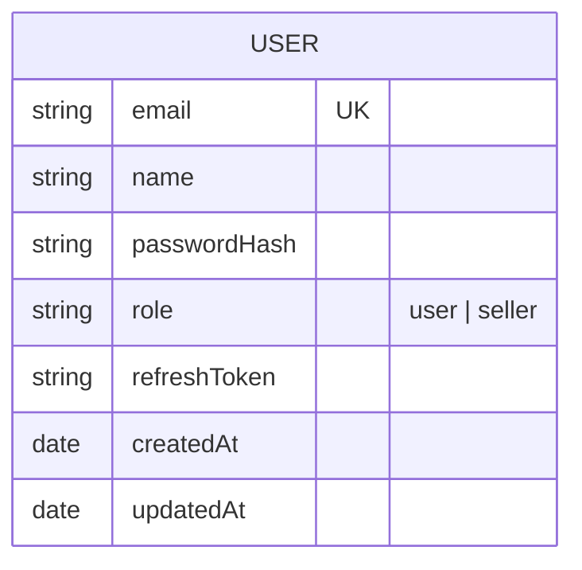

# Auth Service: Flow & Architecture

## Architecture

Requests pass through validation, authentication, and then the controller. Each layer has one job.



| Layer | Responsibility |
| ----- | -------------- |
| Router | Maps endpoints to middleware and controllers |
| Validator | Checks request body shape (express-validator), returns 400 on failure |
| authenticate | Verifies the access token, attaches the payload to `req.user` |
| Controller | Business logic: register, login, refresh, getMe |
| utils | Create and verify access and refresh tokens |
| userModel | Persists the user and the current refresh token |

## Token Design

| Token | Lifetime | Stored in (client) | Stored in (server) | Purpose |
| ----- | -------- | ------------------ | ------------------ | ------- |
| Access token | Short | Memory / `Authorization: Bearer` header | Not stored | Authorize API requests |
| Refresh token | Long | `httpOnly` cookie | `userModel.refreshToken` | Get a new access token |

Both tokens carry `{ userId, role }`.

## Flows

### Register / Login



### Accessing a Protected Route



### Refresh with Rotation and Reuse Detection



**Why rotate?** Every refresh token is single-use. If an old token is replayed, it won't match the stored one, so the stored token is wiped and every session for that user is forced to log in again.

## Data Model



## Folder Structure

```
src/
├── controllers/   register, login, refresh, getMe
├── middlewares/   validators, authenticate
├── models/        userModel
├── routes/        auth routes
└── utils/         create/read token helpers
```

## Error Handling Conventions

| Status | Meaning |
| ------ | ------- |
| 400 | Request body failed validation |
| 401 | Missing, invalid, or expired token; refresh token mismatch |
| 403 | Authenticated but role not allowed |
| 404 | User no longer exists |